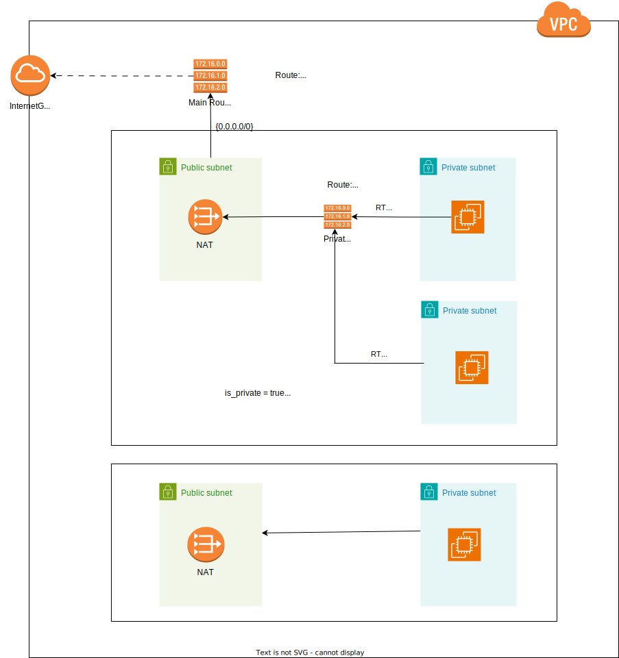

# Perizer AWS VPC Module

This module helps to automate the creation of a VPC and its associated resources (e.g Subnets, route tables and gateways).

<!--  -->

## Usage Notes:
When called, this module creates a **VPC**. You can choose to also create **public subnets** ( with an IGW and public route table), **private subnets** and NAT gateways. By default, when private subnets are created, they don't have NAT gateways. To add a NAT for a private subnet, set `enable_nat = true` in the *.tfvars file. Setting this will provision a NAT gateway, private route table and route for each private subnet where `enable_nat = true`, hence allowing the private subnets reach the internet.

To add or remove subnets, simply add or remove objects from the `subnets` variables. 

## Useful Links:
 - [aws_vpc | Resources | hashicorp/aws | Terraform | Terraform Registry](https://registry.terraform.io/providers/hashicorp/aws/latest/docs/resources/vpc)
 - [aws_subnet | Resources | hashicorp/aws | Terraform | Terraform Registry](https://registry.terraform.io/providers/hashicorp/aws/latest/docs/resources/subnet)

### To-Do
Consider the possibility of adding Security Groups appropriately.
